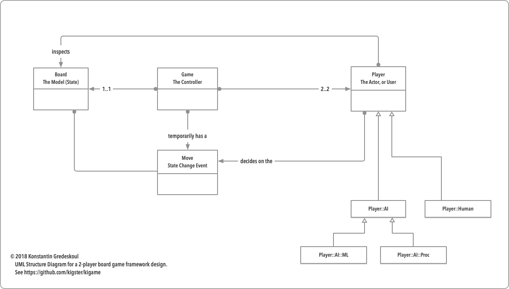
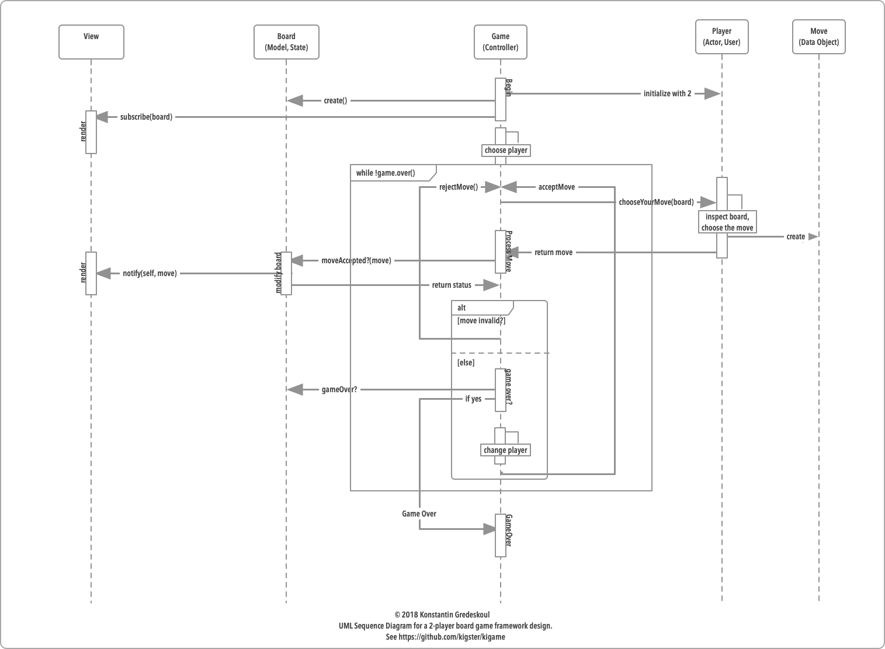

# kigamé 

A set of generic C++ interfaces and classes to aid with modeling basic 2-player board games.

Initially based on the [cmake-ccspec-template](https://github.com/kigster/cmake-ccspec-template) project template and `ccspec` for automated tests.

The goal is to create a simple basic framework for quickly implementing board games in C/C++ 
either on hardware or elsewhere. Two games were used to think through the interface design:
 
  * Gomoku (Five in a Row) and it's smaller cousin — Tic Tac Toe,

  * Simon Says (as implemented on the hardware controller using Adafruit Trellis).

The design goals are simple:

  * Extract boilerplate code and assign responsibilities to the framework classes.

  * Allow for simple subclassing or composition for the actual implementation.

  * As much as possible, use header only files.

## UML

### Structure

### Sequence

